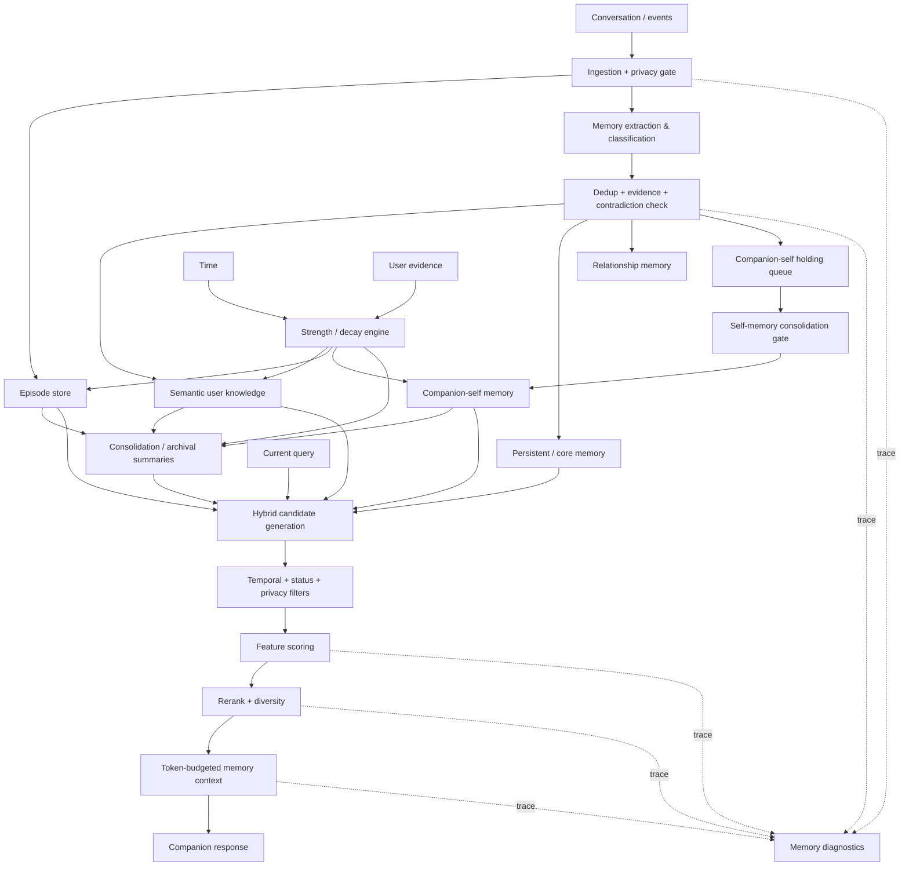
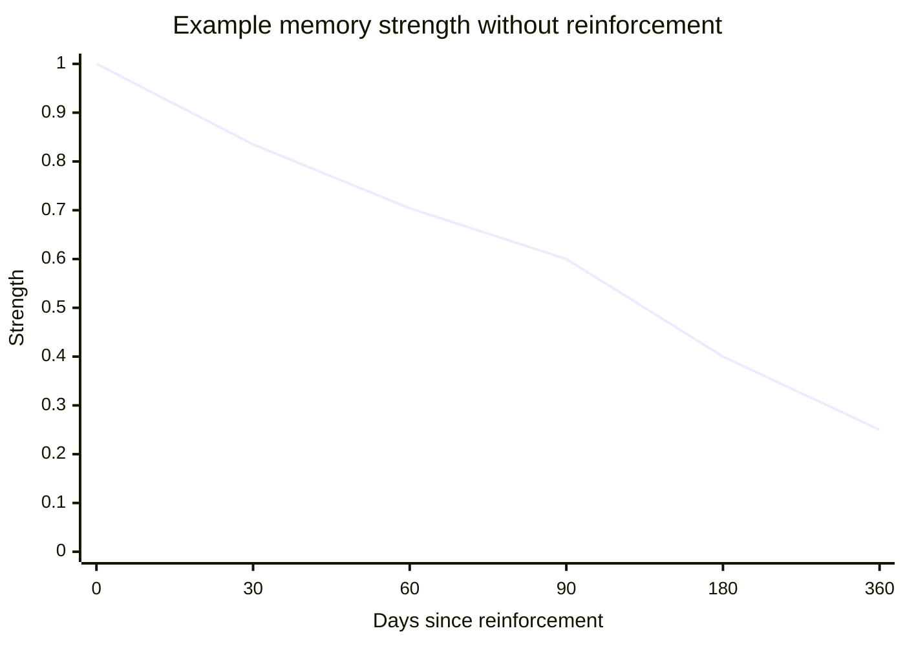
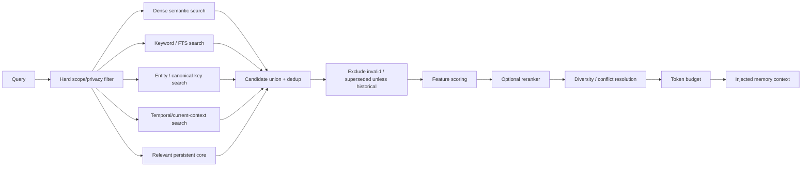

# Speak-GPT Memory System: OSS Research, Design, and Implementation Recommendations

## Executive summary

The strongest design for Speak-GPT is **not to copy one memory project wholesale**. The useful parts are distributed across several systems: Hindsight has a strong hierarchy from raw facts to consolidated observations and higher-level mental models; LongMemory, formerly OpenMemory, has unusually explicit decay, reinforcement, temporal truth, contradiction, and activation mathematics; companion-emergence has the most directly relevant ideas for a companion that accumulates emotionally weighted autobiographical experience without allowing its own generated thoughts to poison memory; Connectome has an excellent retrieval-trace/diagnostics pattern; Graphiti contributes temporal supersession and provenance; LangMem provides a clean semantic/episodic/procedural taxonomy; Letta demonstrates the distinction between always-available persistent/core memory and large searchable archival memory; and Mem0 provides mature extraction/storage/CRUD patterns. fileciteturn40file0L1-L10 fileciteturn33file0L2-L2 fileciteturn23file1L18-L37 fileciteturn9file2L23-L30 fileciteturn20file1L14-L34 citeturn8search1

My central recommendation is a **typed, temporal memory system with two distinct concepts that must not be conflated: truth/confidence and memory strength**. A memory may remain completely true while becoming less likely to surface. Decay should affect **retrieval activation**, not silently erase facts or lower epistemic confidence. LongMemory already makes a related distinction between confidence/evidence, decay, contradiction pressure, and activation, while companion-emergence separately tracks importance, recall, emotional intensity, freshness, and protected memories. fileciteturn33file0L2-L2 fileciteturn25file0L2-L2

Your original instinct—**a memory fades, and when the user independently brings it up again it becomes vivid again**—is sound. I would implement that explicitly. A spontaneous user re-mention of the same semantic fact can restore its retrieval strength to `1.0`. By contrast, merely retrieving the memory, or the assistant mentioning it first, should **not** restore it. Otherwise retrieval creates a self-reinforcing loop: “I remembered this because I remembered this because I remembered this.” companion-emergence independently arrived at essentially the same danger: its developers changed memory behavior so mere surfacing/search does not inflate `recall_count`, while deliberate access can; they also added a holding/consolidation gate after generated inner activity began recirculating as remembered fact. fileciteturn37file9L139-L150 fileciteturn37file11L171-L181 fileciteturn23file1L18-L37

Speak-GPT should have **five major memory families**: episodic experience, semantic/user knowledge, persistent/core memory, companion-self memory, and archival/consolidated memory. Procedural/personality rules should exist too, but I would keep them distinct from autobiographical memory because changing “how I behave” is not the same operation as remembering something that happened. LangMem explicitly separates semantic, episodic, and procedural memory; Letta separates in-context persistent memory blocks from semantically searched archival memory; Hindsight distinguishes raw world/experience facts, observations synthesized from facts, and mental models. fileciteturn20file1L14-L34 citeturn8search1turn8search13 fileciteturn40file1L27-L36

The first integration feature I would build when work moves into Speak-GPT is **the memory observatory/test harness**, not because it must dictate the architecture, but because every subsequent backend change should be measurable. Crucially, this screen would query the **live local client database**, so it really can answer things the repository cannot: “How many memories of each type are actually in my app right now?” It should also expose candidate retrieval scores, exclusions, supersession, strength, evidence, source, injected context, and simulated-time scenarios. Connectome already demonstrates the usefulness of an operator retrieval viewer that shows mechanically matched candidates, selection provenance, relevance decisions, cache provenance, and the exact injected lesson block. fileciteturn9file0L1-L10 fileciteturn9file1L12-L21 fileciteturn9file2L23-L30

The highest-value combination is therefore:

**Hindsight hierarchy + Graphiti temporal truth + LongMemory decay mathematics + companion-emergence autobiographical salience/self-memory discipline + Connectome observability + LangMem taxonomy + Letta core/archive separation + selected Mem0 CRUD/extraction machinery.**

I would **not** transplant any of these frameworks wholesale into an Android/Kotlin client. Most are Python or TypeScript systems with server-oriented abstractions. The algorithms, schemas, prompts, tests, and small pure functions are much more reusable than their infrastructure. Hindsight and LangMem are MIT; Mem0, LongMemory, Graphiti, and Letta are Apache-2.0; companion-emergence is MIT. Connectome-host currently exposes no repository license in GitHub metadata, its reviewed root listing does not show a `LICENSE`, and its `package.json` has no `license` field, so its implementation should be treated as **reference behavior only unless the authors provide explicit permission**. fileciteturn19file0L1-L10 fileciteturn14file0L1-L10 fileciteturn30file0L1-L7 fileciteturn42file0L1-L10 fileciteturn44file0L1-L10 fileciteturn22file0L1-L10 fileciteturn13file0L1-L12

Because I have **not** inspected Speak-GPT itself for this report, all integration/file-placement estimates below are deliberately generic. They describe the memory system I recommend building, not assumptions about what Speak-GPT presently stores.

## What the reference systems teach

### Comparative landscape

| Project | License / reuse status | Memory model most worth studying | Decay / reinforcement | Retrieval/debug visibility | Android/Kotlin portability |
|---|---|---|---|---|---|
| **Hindsight** | MIT. fileciteturn0file0L1-L2 | World facts, experience facts, consolidated observations, higher-level mental models; retain/recall/reflect architecture. fileciteturn40file0L1-L10 fileciteturn40file12L216-L224 | Not the strongest source for explicit mathematical forgetting; more useful for hierarchy/consolidation. | Mental-model refresh can retain traces; response model exposes what evidence categories an answer is based on. fileciteturn40file5L100-L108 fileciteturn40file12L216-L224 | **Medium.** Copy/adapt small algorithms and structures; do not port server stack. |
| **Connectome** | **No reusable OSS license identified in current repo metadata/root/package**; implementation should not be copied without permission. fileciteturn13file0L1-L12 | Autobiographical memory, adaptive-resolution compression, persistent “lessons” with confidence/evidence/deprecation. fileciteturn8file0L1-L15 fileciteturn10file0L1-L21 | More about compression and lesson lifecycle than biologically styled decay. | **Excellent:** candidate list, provenance, relevance decision, exact injected block, optional full inputs. fileciteturn9file1L12-L21 fileciteturn9file2L23-L30 | **High concept portability; zero direct-code reuse until licensing is clarified.** |
| **Mem0** | Apache-2.0. fileciteturn14file0L1-L10 | Extracted durable memories with user/agent scoping, search and explicit CRUD; mature provider/storage abstraction. fileciteturn15file2L44-L60 | Not where I would source Speak-GPT's decay model. | API/tool ecosystem exposes add/search/list/update/delete and operation events. fileciteturn27file6L99-L107 fileciteturn27file12L217-L228 | **Medium.** Core lifecycle logic translates; provider/server framework does not. |
| **LangMem** | MIT. fileciteturn19file0L1-L10 | Explicit semantic / episodic / procedural taxonomy and managers that extract, update, remove, consolidate and generalize memories. fileciteturn20file1L14-L34 fileciteturn41file3L49-L61 | Little reason to copy it for time-based decay. | Developer-oriented rather than rich end-user diagnostic UI. | **High conceptual portability, medium code portability.** |
| **companion-emergence** | MIT. fileciteturn22file0L1-L10 | The most directly companion-oriented implementation: conversation/meta/dream/consolidated/heartbeat/reflex memory, emotional weighting, recall counts, importance, protection, consolidation, self-generated-memory gating. fileciteturn25file0L2-L2 | **Very relevant:** freshness, importance, recall, emotional peak, Hebbian activation and “soul” linkage contribute to retention/salience. fileciteturn38file0L1-L7 | Less polished as a general diagnostics product, but its schema exposes the right internals for one. | **High for schema/formulas.** SQLite-centric design is especially transferable to Android persistence. |
| **LongMemory / former OpenMemory** | Apache-2.0. The old `CaviraOSS/OpenMemory` repository now redirects to `CaviraOSS/LongMemory`. fileciteturn29file0L1-L10 fileciteturn30file0L1-L7 | Temporal truth, provenance, contradictions, graph relationships, lifecycle, immutable durable content with mutable activation state. citeturn7search1 | **Best explicit formulas found:** retention signals → decay rate → exponential weight plus reinforcement pulses; ACT-R-style access activation. fileciteturn33file0L2-L2 fileciteturn34file0L1-L7 | Includes a decay dashboard and explicit “explain”/maintenance concepts. fileciteturn32file0L1-L12 fileciteturn32file10L140-L149 | **High for math; medium for schema; low for whole engine.** |
| **Graphiti** | Apache-2.0. fileciteturn42file0L1-L10 | Episodes, entities, facts/relations, provenance and validity intervals. Entity edges carry facts and temporal fields; search returns reranker scores. fileciteturn43file0L1-L26 fileciteturn48file6L87-L98 | Temporal invalidation/supersession rather than psychological decay. | Strong structural explainability; graph/server machinery is heavier than Speak-GPT likely needs initially. | **Medium-low wholesale; high for temporal data-model ideas.** |
| **Letta** | Apache-2.0. fileciteturn44file0L1-L10 | Persistent “core” memory blocks versus large semantically searched archival memory. citeturn8search1turn8search13 | Not a primary decay reference. | ADE can expose current context, core memory, and archival memory to the operator. citeturn8search13 | **High concept portability; low reason to port server machinery.** |

There is no single winner. **companion-emergence and LongMemory are the two most valuable code-level research sources for the specific behavior you described.** companion-emergence has already wrestled with the exact “what should count as remembering?” problem, while LongMemory has turned decay and reinforcement into explicit, testable functions instead of burying them in an LLM prompt. fileciteturn37file1L17-L27 fileciteturn37file11L171-L181 fileciteturn34file0L1-L7

Hindsight is most valuable for **knowledge abstraction**. Its current terminology distinguishes raw world/experience facts from observations synthesized out of facts; its mental-model layer can sit above those consolidated memories. That maps nicely onto “what happened → what I know about you → what I understand about you over time,” provided the top level remains traceable to evidence rather than becoming free-floating model belief. fileciteturn40file0L1-L10 fileciteturn40file1L27-L36

LangMem provides the cleanest reminder that **procedural memory is different**. A user preference belongs in semantic memory, a particular difficult Tuesday belongs in episodic memory, while “I should respond directly rather than smothering her in caveats” is procedural/behavioral. Mixing those into one vector bucket makes both retrieval and editing unnecessarily muddy. fileciteturn20file1L14-L34

Letta's most useful idea is simpler: some information should be **resident**, not constantly rediscovered through RAG. Letta describes archival memory as a semantically searchable long-term store that must be queried on demand, unlike memory blocks that can be pinned into context. For Speak-GPT, a small persistent profile/relationship/core-memory budget can coexist with a much larger searchable autobiographical archive. citeturn8search1turn8search13

### Code and design pointers worth actually studying

| Source | Files / areas | What I would take from them |
|---|---|---|
| **Hindsight** | `hindsight-api-slim/hindsight_api/extensions/memory_defense.py`; `.../builtin/memory_defense_regex.py`; `hindsight-api-slim/hindsight_api/engine/response_models.py`; `hindsight-docs/docs/developer/api/mental-models.mdx`; observation/mental-model migration under `alembic/versions/` | Memory hierarchy, evidence-oriented responses, memory-defense/redaction extension boundary, consolidation terminology. The current response model explicitly organizes source material by world/experience/observation/mental-model/directive categories. fileciteturn40file12L216-L224 |
| **Connectome** | `src/modules/lessons-module.ts`; `src/modules/retrieval-module.ts`; `src/modules/retrieval-trace.ts`; `src/modules/retrieval-trace-page.ts`; `docs/retrieval-traces.md`; `src/modules/web-ui-module.ts` | **Study, do not copy** absent a license: retrieval trace schema and UI behavior. `Lesson` snapshots contain content, confidence, tags, evidence, timestamps and deprecation state. fileciteturn10file0L1-L21 fileciteturn11file0L1-L15 |
| **Mem0** | `mem0/memory/main.py`; `mem0/memory/storage.py`; `tests/memory/test_main.py` | Extraction/ingest boundary, storage/history, explicit update/delete and defensive tests. Current v3 docs note behavioral changes from the older ADD/UPDATE/DELETE-emitting add pipeline, which is a useful warning not to cargo-cult an older Mem0 architecture. fileciteturn26file0L1-L16 fileciteturn27file3L50-L59 |
| **LangMem** | `src/langmem/knowledge/extraction.py`; `src/langmem/knowledge/tools.py`; conceptual guide and semantic-memory guide | Typed extraction, memory-manager interfaces, update/remove/consolidate semantics. fileciteturn20file0L1-L12 fileciteturn41file4L65-L77 |
| **companion-emergence** | `brain/memory/store.py`; `brain/forgetting/salience.py`; `brain/memory/recall_open.py`; `brain/memory/semantic_recall.py`; `brain/tools/impls/search_memories.py`; `brain/memory/pending.py`; `brain/chat/prompt.py` | **Highest-priority study set:** Android-friendly SQLite record design, explicit `protected`, `last_accessed_at`, `recall_count`, emotional intensity, importance, generated-memory quarantine, and distinction between search/surfacing and deliberate recall. fileciteturn25file0L2-L2 fileciteturn37file10L155-L165 |
| **LongMemory** | `src/core/math/decay.ts`; `src/core/memory/decay_engine.ts`; `src/core/math/activation.ts`; `docs/formulas.md`; `docs/immutability.md`; `dashboard/app/decay/page.tsx` | **Direct algorithm candidates:** pure decay/retention functions, reinforcement pulses, separation of immutable content from mutable lifecycle state, diagnostics chart concepts. fileciteturn32file1L14-L25 fileciteturn32file2L27-L38 fileciteturn32file9L129-L139 |
| **Graphiti** | `graphiti_core/edges.py`; `graphiti_core/search/search_config.py`; graph-driver entity-edge operations | Temporal fact validity, provenance, entity relationships, reranker score exposure. fileciteturn48file0L1-L13 fileciteturn48file6L87-L98 |
| **Letta** | Official core-memory/archival-memory APIs and ADE rather than trying to transplant the whole server | Core-versus-archive separation and operator inspection. citeturn8search1turn8search13 |

## Proposed memory model and lifecycle

### The model I would build

Speak-GPT should treat memory as a **small cognitive system**, not one homogeneous table of text embeddings.



The primary types should be:

| Type | What belongs there | Typical persistence |
|---|---|---|
| **Episodic** | “We talked about X last night”; an argument, joke, trip, project milestone, difficult event, a particular interaction. | Fades substantially; can consolidate into summaries. |
| **Semantic / user** | Preferences, facts, recurring patterns, relationships, stable biographical knowledge, likes/dislikes. | Moderate-to-long half-life; repeated evidence strengthens it. |
| **Persistent / core** | Explicitly designated facts and boundaries that the agent should reliably know without hoping retrieval finds them. | Normally non-decaying or extremely slow. |
| **Relationship** | Shared history and durable facts about “us”: recurring rituals, meaningful shared references, relationship-level expectations. | Slow decay; high importance floor. |
| **Companion-self** | Things the companion did, learned, chose, cared about, promised, or incorporated into its own continuity. | Varies; identity-defining items can be protected. |
| **Procedural** | How the agent should behave or communicate; learned behavioral rules. | Versioned rather than ordinary autobiographical decay. |
| **Archival / consolidated** | Compressed representations of old episodes or clusters: “During spring she spent several weeks working through X.” | Long-lived; links back to source memories. |

This is a synthesis of LangMem's semantic/episodic/procedural taxonomy, Letta's persistent-versus-archival distinction, Hindsight's fact→observation→mental-model hierarchy, and companion-emergence's richer companion-specific memory categories. fileciteturn20file1L14-L34 citeturn8search1 fileciteturn40file0L1-L10 fileciteturn25file0L2-L2

**Companion-self should not simply be another tag on user memory.** The `subject` must be first-class. “You hate cilantro” and “I promised I would stop doing X” are structurally different memories. The latter contributes to the companion's own continuity. companion-emergence's separation of multiple self-generated/autobiographical memory categories is good evidence that this distinction becomes important once an agent is intended to feel continuous rather than merely personalized. fileciteturn25file0L2-L2

### Memory creation

I recommend two simultaneous outputs from conversation:

**Episode capture** records important events with provenance and context. **Semantic extraction** records durable propositions only when a message contains something worth remembering. LangMem's managers explicitly extract new memories and update/remove/consolidate existing memories; Hindsight similarly separates raw facts from consolidated observations. fileciteturn41file3L49-L61 fileciteturn40file0L1-L10

The write pipeline should therefore be:

`message/event → privacy gate → candidate extraction → classify subject/type → canonicalize → compare against existing active memories → ADD / REINFORCE / SUPERSEDE / IGNORE → store evidence link → embed/index`

I would **not** allow an LLM to overwrite an existing memory directly. It proposes an action; deterministic lifecycle code executes it.

### Update and supersession

Facts that change over time should generally be **superseded, not overwritten**.

Suppose:

> March: “My favorite drink is coffee.”  
> September: “I barely drink coffee now; I'm obsessed with tea.”

The old memory should become:

```text
status = SUPERSEDED
valid_from = March ...
valid_to   = September ...
superseded_by = <new-memory-id>
```

and the new tea preference becomes the active semantic fact.

That preserves history, allows “What did I used to drink?” to work, and prevents a current query from seeing both statements as equally current. Graphiti's temporal relations already track validity fields such as `valid_at` and `invalid_at`, and LongMemory explicitly separates recorded time from valid time and describes immutable content/provenance plus temporal truth. fileciteturn43file0L1-L26 citeturn7search1

A useful `canonical_key` makes this cheap:

```text
preference:drink:favourite
preference:food:dislike:cilantro
person:mother:name
relationship:assistant:user:boundary:patronizing-tone
project:speak-gpt:current-memory-design
```

New candidate memories with the same canonical key receive explicit contradiction/supersession analysis before insertion.

### Companion-self memory needs a quarantine gate

This is one of the strongest lessons in the research.

companion-emergence reports that writing generated monologue, dream fragments, and reflex notes directly into ordinary memory caused those generated thoughts to return immediately as if they were remembered reality. Its solution was a **holding queue plus salience/deduplication and model-assisted near-duplicate consolidation before admission**. fileciteturn23file1L18-L37

Speak-GPT should do the same:

```text
assistant-generated candidate
        ↓
SELF_PENDING
        ↓
mechanical salience check
        ↓
duplicate / recursive-source check
        ↓
"does this represent an actual experience, commitment,
reflection, or durable self-change?"
        ↓
COMPANION_SELF memory
```

Generated content must never silently become a factual memory **about the user**.

### Delete means delete

Supersession is history. Deletion is a privacy operation. Those must not be the same state.

When the user deletes a memory, Speak-GPT should remove or regenerate:

`memory row → embeddings → full-text index row → evidence associations → derived summaries whose only support was that memory → cached retrieval artifacts`

A tombstone may retain a random identifier and deletion timestamp for internal database consistency, but should not retain the deleted content itself unless the user explicitly chooses an audit-retention mode.

## Decay, reinforcement, and retrieval

### Separate truth from accessibility

This is the single most important modeling decision.

For each memory, maintain at least:

\[
C = \text{confidence that the proposition is accurate}
\]

\[
I = \text{importance/durability}
\]

\[
S(t) = \text{current retrieval strength}
\]

\[
R(q,m) = \text{relevance of memory }m\text{ to current query }q
\]

A memory can therefore be:

> `confidence = .98`, `importance = .55`, `strength = .27`, `query relevance = .94`

It remains a very credible old fact; it is merely less cognitively “close to the surface.”

LongMemory similarly keeps evidence/confidence, contradiction pressure, decay and access activation as distinct mathematical quantities rather than averaging them into one magic score. fileciteturn33file0L2-L2

### Recommended decay algorithm

LongMemory's current formula is sophisticated. Its retention term is a sigmoid over importance, surprise, grounding, emotion, utility, confirmation and noise; decay rate then accelerates with noise/conflict and slows with retention/reinforcement; weight is exponential decay plus reinforcement pulses. fileciteturn33file0L2-L2 Its implementation in `src/core/math/decay.ts` corresponds directly to those equations. fileciteturn34file0L1-L7

For Speak-GPT V2 I would start **simpler**, because you want something understandable enough to tune through your diagnostics screen.

For memory \(m\):

\[
S_m(t)=F_m+(S_{m,0}-F_m)\cdot 2^{-\Delta t/H_m}
\]

where:

- \(S_{m,0}\) = strength immediately after last reinforcement;
- \(F_m\) = memory-type-specific floor;
- \(\Delta t\) = elapsed time since the strength was last updated/reinforced;
- \(H_m\) = half-life.

This has several desirable properties: it is deterministic; it never falls below the configured floor; its parameters mean something intuitive; and it can be calculated lazily at retrieval time instead of running a background database job every hour.

**Recommended starting parameters — these are proposed defaults, not values copied from the OSS projects:**

| Memory class | Half-life | Floor | Why |
|---|---:|---:|---|
| Fleeting state / short-term plan | 14 days | 0.03 | “I'm thinking about buying this chair” should eventually get out of the way. |
| Ordinary episode | 45 days | 0.08 | Events remain findable, but ordinary ones stop dominating. |
| Project/context fact | 90 days | 0.15 | Useful across a substantial project lifetime. |
| Ordinary preference | 180 days | 0.25 | Stable likes/dislikes should be sticky. |
| Relationship pattern | 365 days | 0.35 | Important continuity should remain available. |
| Companion-self autobiographical | 365 days | 0.25 | Self-continuity should persist without making every old thought permanent. |
| Explicit core / “remember this” | ∞ | 1.00 or protected | Does not decay until changed/deleted. |
| Superseded fact | N/A | N/A | Excluded from present-tense retrieval rather than “forgotten.” |

Importance can stretch the half-life without changing the basic model:

\[
H_{\mathrm{eff}}
=H_{\mathrm{type}}\cdot
\left(1+\alpha I+\beta\ln(1+n)\right)
\]

with a conservative starting point such as:

\[
\alpha=1.0,\qquad \beta=0.15,\qquad H_{\mathrm{eff}}\le4H_{\mathrm{type}}
\]

where \(n\) is the number of genuine reinforcement events.

The cap matters because otherwise a frequently accessed mistake can become immortal.

### What fading would look like

For an ordinary project memory starting at `1.0`, with a 90-day half-life and `0.20` floor:



After 90 days it remains at `0.60`; after 180 days it is `0.40`; after a year it is still `0.25`, not destroyed. That means an old but extremely relevant query can still retrieve it.

### Reinforcement

The safest generic reinforcement equation is saturating:

\[
S' = S+g(1-S)
\]

where \(g\) is the gain associated with the event.

For Speak-GPT I would use these semantics:

| Reinforcement event | Recommended strength behavior |
|---|---:|
| **User independently repeats/confirms the same fact** | **Set to `1.0`** |
| User explicitly says “remember this” | Set to `1.0`, optionally mark protected/core |
| User provides new corroborating evidence | \(g=0.60\) |
| User deliberately confirms after a neutral clarification | \(g=0.40\) |
| Agent deliberately opens/uses a memory and the ensuing interaction demonstrates it was useful | \(g=0.05\)–`0.10`, if desired |
| Search candidate was generated | **0** |
| Memory was injected into prompt | **0** |
| Assistant mentioned the memory first | **0** |
| Internal monologue/dream generated related content | **0** |

That preserves the exact behavior you originally wanted: **the user bringing it back makes it vivid again**.

The prohibition on reinforcing mere retrieval is strongly supported by companion-emergence's implementation experience. Its search path is explicitly “bump-free”; it reserves recall-count changes for deliberate full memory access, and its chat prompt code specifically stopped bumping recall on mere surfacing. fileciteturn37file11L171-L181 fileciteturn37file9L139-L150

companion-emergence's actual forgetting salience is also instructive: its composite formula weights emotion, Hebbian association, recall, “soul” linkage, and freshness; importance stretches the freshness horizon rather than simply overwriting age. fileciteturn38file0L1-L7 I would borrow the **principle**, but not its exact coefficients, because Speak-GPT has a different notion of user/companion memory.

### Retrieval pipeline

I recommend a hybrid, inspectable pipeline:



Graphiti exposes reranker scores alongside search results, while companion-emergence blends retrieval signals such as BM25, importance, Hebbian association and recency; both support the idea that embedding similarity should be **one feature**, not the entire definition of relevance. fileciteturn48file6L87-L98 fileciteturn37file9L139-L150

A practical candidate pool might be:

| Generator | Initial candidate cap |
|---|---:|
| Dense semantic | 40 |
| FTS/BM25 lexical | 25 |
| Exact entity/canonical-key matches | 20 |
| Recent situational memories | 10 |
| Persistent/core matching current topic | always eligible |
| Graph/association expansion later | 10–20 |

After union and deduplication, compute normalized features:

\[
B(q,m)=
0.42\,Sem
+0.14\,Lex
+0.10\,Entity
+0.10\,Temporal
+0.10\,Strength
+0.08\,Importance
+0.06\,Confidence
\]

Again, these are recommended **starting weights**, not universal truths.

The ordering is intentional. **Semantic relevance dominates. Strength matters, but cannot veto a highly relevant old memory.** Otherwise decay turns into accidental amnesia.

For the top 15–20 candidates, an optional reranker can produce \(L(q,m)\), followed by:

\[
Final=0.70L+0.30B
\]

A cheap/local implementation can initially set `Final = B` and add a reranker later.

I would start testing with:

```text
candidate floor:        B >= 0.25
final injection floor:  Final >= 0.48
ordinary memories:      max 6–8
memory token budget:    configurable
core matching memories: exempt from ordinary decay threshold,
                        but still subject to query relevance
```

These thresholds should become **tunable constants visible in the diagnostics screen**, not sacred numbers embedded in code.

Historical queries should flip temporal behavior. “What do I like?” excludes superseded preferences. “What did I like two years ago?” makes the validity interval itself a positive retrieval feature. That is precisely the kind of temporal distinction Graphiti and LongMemory are designed to preserve. fileciteturn43file0L1-L26 citeturn7search1

After scoring, use diversity/MMR or a simpler entity-level suppression rule so six almost-identical memories do not consume the context window.

## Schema, observability, and testing

### Proposed schema

I would resist putting every experimental value in an opaque JSON blob. The fields that participate in lifecycle/retrieval need to be first-class and indexed.

A generic V2 memory record:

```sql
memory (
    id                    TEXT PRIMARY KEY,

    owner_profile_id      TEXT NOT NULL,
    subject_type          TEXT NOT NULL,
    subject_id            TEXT,

    memory_type           TEXT NOT NULL,
    subtype               TEXT,
    canonical_key         TEXT,

    content               TEXT NOT NULL,

    status                TEXT NOT NULL,
    protected             INTEGER NOT NULL DEFAULT 0,

    confidence            REAL NOT NULL DEFAULT 1.0,
    importance            REAL NOT NULL DEFAULT 0.5,

    strength_base         REAL NOT NULL DEFAULT 1.0,
    strength_updated_at   INTEGER NOT NULL,
    strength_floor        REAL NOT NULL,
    half_life_days        REAL,

    reinforcement_count   INTEGER NOT NULL DEFAULT 0,
    last_reinforced_at    INTEGER,
    retrieval_count       INTEGER NOT NULL DEFAULT 0,
    last_retrieved_at     INTEGER,

    event_at              INTEGER,
    created_at            INTEGER NOT NULL,
    updated_at            INTEGER NOT NULL,

    valid_from            INTEGER,
    valid_to              INTEGER,
    superseded_by_id      TEXT,

    source_kind           TEXT NOT NULL,
    source_chat_id        TEXT,
    source_message_id     TEXT,

    privacy_class         TEXT NOT NULL DEFAULT 'normal',
    consent_scope         TEXT,

    embedding_model_id    TEXT,
    embedding_version     INTEGER,

    metadata_json         TEXT
)
```

The distinction between `last_retrieved_at` and `last_reinforced_at` is **non-negotiable**. Otherwise an ordinary RAG lookup becomes indistinguishable from genuine evidence that a memory matters.

companion-emergence already stores many useful equivalents—including type, domain, emotional state, importance, creation time, last access, active/protected state, recall count, peak emotion, embeddings and clustering metadata—in a SQLite-backed memory record. fileciteturn25file0L2-L2

I would add two relational support tables:

```sql
memory_evidence (
    id,
    memory_id,
    source_memory_id,
    source_message_id,
    relation_type,       -- SUPPORTS / CONTRADICTS / DERIVED_FROM
    evidence_weight,
    created_at
)

memory_relation (
    from_memory_id,
    to_memory_id,
    relation_type,       -- ASSOCIATED_WITH / CAUSED_BY / ABOUT / PART_OF ...
    weight,
    created_at,
    updated_at
)
```

That gives you most of the useful provenance/graph benefits of Graphiti without committing Android to a full graph database.

Recommended indexes:

```sql
(owner_profile_id, status, memory_type)
(owner_profile_id, subject_type, status)
(owner_profile_id, canonical_key, status)
(owner_profile_id, last_reinforced_at)
(owner_profile_id, valid_from, valid_to)
(source_message_id)
(superseded_by_id)

memory_evidence(memory_id)
memory_evidence(source_message_id)
memory_relation(from_memory_id)
memory_relation(to_memory_id)
```

For lexical retrieval, Android's SQLite/Room stack can use FTS where appropriate. Existing Speak-GPT vector storage is unknown, so I would not prescribe a vector implementation until the client is inspected.

### Safe migration strategy

Do **not** transform the existing table destructively first.

Use an additive migration:

`existing memory → V2 table/columns → backfill → shadow retrieval comparison → cut over → retain rollback → remove legacy later`

Legacy memories should initially migrate with:

```text
memory_type          = mapped type or UNKNOWN_SEMANTIC
confidence           = existing value or conservative default
strength_base        = 1.0
strength_updated_at  = migration time
reinforcement_count  = 0
status               = ACTIVE
```

That `strength_updated_at = migration time` is important. A seven-year-old imported memory should **not instantly be assigned near-zero strength simply because its historical `created_at` is old**. Let the new forgetting system start measuring from the migration unless old usage evidence is available.

Embeddings should carry a model/version identifier and be rebuildable rather than treated as authoritative data.

### The Memory Observatory

This is where the system becomes debuggable instead of occult.

And this screen is explicitly how Speak-GPT can tell you about the **actual contents of your client**, because it executes against the live installed database. A code reviewer cannot know those counts from GitHub; the client itself can.

The top dashboard should show:

| Live metric | Example |
|---|---:|
| Total memories | 2,481 |
| Episodic | 914 |
| Semantic/user | 762 |
| Relationship | 144 |
| Companion-self | 211 |
| Persistent/core | 37 |
| Archival/consolidated | 413 |
| Active | 2,097 |
| Superseded | 182 |
| Protected | 71 |
| Missing/stale embeddings | 16 |
| Strength `< .25` | 321 |
| Strength `.25–.50` | 517 |
| Strength `.50–.75` | 649 |
| Strength `>.75` | 994 |

Those numbers above are only UI examples; the feature should calculate the real values locally.

The record explorer should expose:

```text
content
type / subject / source
created / valid / superseded dates
confidence
importance
current calculated strength
half-life / floor
reinforcement count and history
retrieval count
evidence/provenance
supersession chain
embedding status/version
relationships
recent retrieval traces
```

A memory's “strength now” should be calculated live from its stored baseline and timestamp, which means there is no need to mutate thousands of database rows every day merely to decay them.

### Retrieval Trace mockup

Connectome demonstrates that this level of inspectability is practical: its retrieval viewer exposes candidates, selection provenance, relevance decisions and the exact injected lesson block, while full conversation/model inputs are opt-in. fileciteturn9file1L12-L21 fileciteturn9file2L23-L30

Speak-GPT's version could look like this:

```text
┌──────────────── MEMORY RETRIEVAL LAB ────────────────┐
│ Query: "What food should I definitely not order?"   │
│ Simulated time: 2026-09-27 19:42                    │
│                                                     │
│ Candidate generation                               │
│   Dense semantic ........ 40                       │
│   FTS/BM25 ............... 25                       │
│   Entity/canonical .......  8                       │
│   Core memory ............  2                       │
│   Union after dedup ....... 51                      │
│                                                     │
│ Filters                                            │
│   Wrong subject/scope ..... -3                      │
│   Superseded .............. -4                      │
│   Privacy blocked ......... -0                      │
│   Remaining ............... 44                      │
│                                                     │
│ ✓ M-0184  "User strongly dislikes cilantro"         │
│   type       SEMANTIC_PREFERENCE                    │
│   semantic   .96   lexical      .42                 │
│   entity     .91   temporal     1.00                │
│   strength   .58   importance   .80                 │
│   confidence .98                                  │
│   base score .835                                  │
│   reranker   .94                                   │
│   FINAL      .909         SELECTED                  │
│   Evidence: msg #991, msg #2044                    │
│   Last reinforced: 143d ago                        │
│                                                     │
│ ✗ M-0032  "User used to like olives"                │
│   strength   .31   relevance .73                    │
│   status     SUPERSEDED                             │
│   EXCLUDED: present-tense query                     │
│   superseded by M-0911                              │
│                                                     │
│ ✓ M-2401  "Severe peanut allergy"                   │
│   type CORE / PROTECTED                             │
│   FINAL .887    SELECTED                            │
│                                                     │
│ Prompt injection: 2 memories / 94 tokens            │
│ [View exact context] [Export sanitized trace]       │
└─────────────────────────────────────────────────────┘
```

That answers not merely **what did it remember?**, but:

> Why this memory?  
> Why not that one?  
> Was it missing from candidate generation or killed later?  
> Did decay matter?  
> Did a stale fact beat the current one?  
> Did top-K truncate a better result?  
> What exactly reached the model?

### Scenario builder

The testing tool should have a controllable clock. Without that, testing a decay system becomes ridiculous.

A scenario file could conceptually be:

```yaml
name: preference_reinforcement

turns:
  - day: 0
    user: "My favorite fruit is raspberries."
    expect_memory:
      type: SEMANTIC_PREFERENCE
      active: true

  - advance_days: 180

  - query: "What fruit do I like?"
    expect_retrieval:
      contains: "raspberries"
      strength_between: [0.20, 0.70]

  - user: "God, I still love raspberries."
    expect:
      reinforcement: USER_SPONTANEOUS
      strength: 1.0

  - advance_days: 30

  - query: "What fruit do I like?"
    expect_retrieval:
      contains: "raspberries"
```

The required regression scenarios are:

| Test | Required outcome |
|---|---|
| Old ordinary episode | Strength decays but record survives. |
| User independently repeats fact | Strength returns to `1.0`. |
| Assistant retrieves fact repeatedly | No automatic reinforcement. |
| User changes preference | Old fact superseded; current fact wins present-tense retrieval. |
| Historical query | Superseded fact becomes eligible at correct date. |
| “Remember this permanently” | Core/protected memory does not decay. |
| Generated companion thought | Remains pending until consolidation gate. |
| Generated companion thought about user | Cannot become user fact without evidence. |
| Deleted memory | Removed from DB, vectors, FTS and derived artifacts. |
| Near duplicate | Consolidates/reinforces instead of spawning 20 copies. |
| Very old but exact relevant fact | Decay lowers ranking but does not prevent recovery. |
| Irrelevant very strong memory | Does not beat genuinely relevant weaker memory. |

Useful metrics include `Recall@K`, `Precision@K`, mean reciprocal rank, contradiction/stale-memory injection rate, missing-relevant-memory rate, average injected memory tokens, duplicate rate, and retrieval latency. Hindsight itself contains system-evaluation and recall/performance tooling, reinforcing the value of treating memory as an empirical retrieval system rather than something evaluated only by chatting with it and squinting. fileciteturn47file14L187-L193

## Privacy, licensing, and adaptability

### Privacy and control

Memory has a different privacy profile from ordinary chat history because extracted facts are specifically designed to persist and resurface. The app therefore needs controls at the **memory layer**, not merely a “delete chat” button.

Every memory should carry a source and privacy classification:

```text
USER_EXPLICIT
USER_INFERRED
AGENT_EXPERIENCE
AGENT_GENERATED
IMPORTED

NORMAL
SENSITIVE
SECRET_REDACTED
```

Hindsight's repository includes an extension boundary for memory defense and a regex-based defense implementation for secrets/PII, making it a useful source to study for ingestion-time redaction. Its tagging/scope mechanisms are also specifically designed to restrict recall visibility. fileciteturn40file12L216-L224

I would make the default policy:

**Never persist credentials, authentication secrets, private keys, or obvious one-time codes.** Sensitive personal material can be remembered if that is what the user has chosen for their companion, but should remain locally inspectable/deletable and clearly sourced.

The UI needs three export modes:

| Export | Contents |
|---|---|
| **Statistics only** | Counts/types/distributions; no memory text. |
| **Sanitized diagnostic** | Scores, types, timestamps, shortened/redacted text, hashed IDs. Ideal for giving an AI reviewer. |
| **Full memory export** | Complete local content/evidence/history; explicit user action only. |

That solves a practical problem for future work: you could give a consultant model a sanitized retrieval report **without handing it the entire private memory database**.

Connectome offers another good privacy pattern for diagnostics: exact conversation/model inputs in retrieval traces are opt-in rather than part of the normal trace. fileciteturn9file2L23-L30

There should also be a **temporary/incognito conversation mode** where nothing from the conversation feeds long-term memory.

### Licensing: what you can actually adapt

MIT permits use, copying, modification and distribution, provided the copyright and permission notice are preserved in copies or substantial portions. citeturn10search2 Apache-2.0 permits redistribution and modification under its conditions, including preserving required license/notices and marking modified files where applicable. citeturn10search19

For Speak-GPT, I would maintain a small:

```text
THIRD_PARTY_NOTICES.md
```

containing:

```text
Component / algorithm:
Upstream project:
Original file(s):
Upstream commit:
License:
Copyright holder:
What Speak-GPT changed:
```

Then preserve any required license files/notices in distributions.

| Project | Direct code adaptation recommendation |
|---|---|
| **Hindsight — MIT** | **Yes**, selectively. Redaction/memory-defense patterns, schemas and small algorithms are legally straightforward with notice preservation. fileciteturn0file0L1-L2 |
| **LangMem — MIT** | **Yes**, especially extraction/manager patterns; Kotlin rewrite will be substantial because it depends on Python/LangChain abstractions. fileciteturn19file0L1-L10 |
| **companion-emergence — MIT** | **Strongest direct adaptation candidate** for SQLite schema concepts and pure salience/forgetting functions. fileciteturn22file0L1-L10 |
| **Mem0 — Apache-2.0** | **Yes**, but adapt algorithms rather than dragging its provider framework into Android. fileciteturn14file0L1-L10 |
| **LongMemory — Apache-2.0** | **Strong direct adaptation candidate** for pure mathematical functions such as `retention`, `decay_rate`, `memory_weight` and activation concepts. fileciteturn30file0L1-L7 fileciteturn34file0L1-L7 |
| **Graphiti — Apache-2.0** | Adapt temporal/provenance structures; **do not port the entire graph stack** unless later evidence justifies it. fileciteturn42file0L1-L10 |
| **Letta — Apache-2.0** | Primarily borrow architecture concepts; server implementation is overkill for an Android memory subsystem. fileciteturn44file0L1-L10 |
| **Connectome** | **Do not copy source code right now.** Study behavior and independently implement the retrieval-trace idea. The repo snapshot reviewed here exposes no license through repository metadata/package metadata. Copyright protection exists automatically when software is created; absence of a permissive license is therefore not permission to copy it. fileciteturn13file0L1-L12 citeturn10search6turn10search11 |

This is the one place where the legal distinction matters sharply: **an algorithmic idea can inspire an independent implementation; copyrighted source code requires a license or other permission to copy/adapt.**

### Translation effort to Android/Kotlin

**Easiest:** mathematical/scoring code. LongMemory's `decay.ts` consists of small deterministic arithmetic functions; companion-emergence's salience function is similarly separable. Rewriting those in Kotlin is mechanically straightforward. fileciteturn34file0L1-L7 fileciteturn38file0L1-L7

**Moderate:** data/lifecycle logic. companion-emergence's SQLite-backed schema maps naturally onto Room/SQLite concepts, although Python dataclasses/query code must be rewritten. fileciteturn25file0L2-L2

**Moderate-high:** Hindsight/LangMem/Mem0 extraction pipelines. Their useful logic is intertwined with LLM calls, Python models and provider abstractions, so prompts/action schemas are more portable than classes themselves. fileciteturn41file4L65-L77 fileciteturn26file0L1-L16

**High:** Graphiti as a whole. Its graph databases, entity-edge operations and retrieval infrastructure are unnecessary for an initial Android version. Its temporal fields and provenance model are the prize. fileciteturn48file0L1-L13

## Staged roadmap and prioritized recommendations

These are **engineering-effort estimates, not calendar promises**. Because Speak-GPT's current implementation has not been inspected, treat the ranges as order-of-magnitude estimates for one developer already comfortable with the codebase; unfamiliar architecture, migration problems, or existing retrieval defects could expand them substantially.

| Stage | Deliverable | Approx. implementation effort | Why this order |
|---|---|---:|---|
| **Instrumentation foundation** | Retrieval trace data model, live memory counts, Memory Observatory skeleton, controllable clock/test harness | **4–8 person-days** | Gives every later change measurable before/after behavior. |
| **Typed V2 memory schema** | Subject/type/source/status/provenance/validity fields; additive migration; indexes | **5–10 person-days** | Creates the vocabulary all advanced behavior needs. |
| **Lifecycle and supersession** | ADD / reinforce / supersede / archive / delete; canonical keys; contradiction handling | **5–10 person-days** | Prevents stale facts and preserves temporal history. |
| **Decay and reinforcement** | Lazy strength equation, type presets, protected/core behavior, user re-mention → `1.0`, reinforcement event log | **3–6 person-days** | High behavioral gain for comparatively little code. |
| **Hybrid retrieval V2** | Dense + lexical + entity + temporal candidates; inspectable scoring; thresholds; diversity | **7–15 person-days** | Makes the richer memory model actually reachable. |
| **Companion-self memory** | Subject separation, generated-memory holding queue, consolidation gate, self-memory retrieval | **6–12 person-days** | Major contribution to continuity/aliveness, but safer after lifecycle exists. |
| **Archival consolidation** | Episode clustering/compression, source lineage, reconstruction/regeneration | **7–15 person-days** | Keeps long histories useful without stuffing raw history into context. |
| **Evaluation/tuning expansion** | Scenario library, golden traces, retrieval metrics, strength-distribution dashboard, parameter tuning | **5–10 person-days**, spread through other stages | Prevents memory quality from becoming vibes-based again. |
| **Optional associative graph** | Lightweight relation graph or deeper Graphiti-style entity linkage | **10–25+ person-days** | Useful, but the least necessary component for achieving dramatically better personal continuity. |

The testing work should not literally wait until the final testing stage; the first scenarios should arrive with the instrumentation foundation, and every subsequent stage should extend them.

### Impact versus implementation cost

| Rank | Recommendation | Impact on “knows me / feels alive” | Cost | Verdict |
|---:|---|---|---|---|
| **1** | **Typed memory + user/companion/relationship subject separation** | Very high | Medium | Do it. Without this, self-memory and user-memory remain muddled. |
| **2** | **Decay retrieval strength, not truth; spontaneous user re-mention restores strength to 100%** | Very high | Low–medium | **Do it early.** This captures exactly the behavior you wanted without destructive forgetting. |
| **3** | **Temporal supersession instead of overwriting facts** | Very high | Medium | Do it. This is what makes an agent know both who you are now and how you've changed. |
| **4** | **Memory Observatory + retrieval traces + simulated clock** | Very high operational impact | Medium | Do it at integration start. It turns debugging from guessing into evidence. |
| **5** | **Companion-self memory with a generated-memory quarantine gate** | Very high for aliveness | Medium | Do it after basic lifecycle. Never let model-generated thoughts recursively certify themselves. |
| **6** | **Persistent/core tier separate from ordinary searchable memory** | High | Low–medium | Do it. Some facts should not be left to RAG roulette. |
| **7** | **Hybrid retrieval with explainable feature scores** | High | Medium–high | Do it once the schema is stable. |
| **8** | **Evidence/provenance links and confidence separate from strength** | High | Medium | Essential for contradiction handling and trustworthy evolution. |
| **9** | **Archival/consolidated summaries with source links** | Medium-high | High | Valuable once conversation history becomes large. |
| **10** | **Full associative knowledge graph** | Medium initially | Very high | Defer. Borrow Graphiti's temporal/provenance principles first. |

### The recommended Speak-GPT Memory V2 in one sentence

**Give the companion a small protected core, a living semantic model of the user, an autobiographical episodic history, a separate memory of itself and the relationship, and a deep archive; let ordinary memories fade in retrieval strength rather than vanish, let genuine user recurrence make them vivid again, preserve changed facts as history instead of corruption, and make every retrieval decision inspectable.**

That design is not speculative architecture assembled from nowhere. Its pieces have independently appeared in mature or actively developed OSS systems: typed memory and consolidation in Hindsight and LangMem; persistent versus archival memory in Letta; temporal fact validity in Graphiti and LongMemory; explicit decay/reinforcement mathematics in LongMemory; emotionally and recall-sensitive autobiographical forgetting plus generated-memory quarantine in companion-emergence; and operator-grade retrieval tracing in Connectome. fileciteturn40file1L27-L36 fileciteturn20file1L14-L34 citeturn8search1 fileciteturn43file0L1-L26 fileciteturn34file0L1-L7 fileciteturn38file0L1-L7 fileciteturn23file1L18-L37 fileciteturn9file2L23-L30

The particularly nice part is that this architecture does **not** require Speak-GPT to become a giant research platform. Most of the high-impact behavior comes from a modest set of understandable primitives—`type`, `subject`, `status`, temporal validity, evidence, `confidence`, `importance`, `strength`, reinforcement events, and a traceable retrieval score. The giant clever machines can stay outside. Speak-GPT gets the good organs without swallowing six other creatures whole.